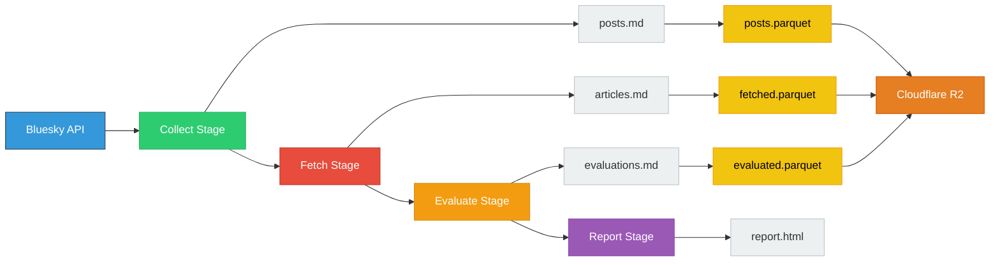

# Bluesky MCP Monitor

A service that monitors Bluesky for Model Context Protocol (MCP) mentions, evaluates linked content, and generates daily reports.

## Overview

The Bluesky MCP Monitor tracks posts and discussions about the Model Context Protocol (MCP) on Bluesky. It collects posts, fetches linked articles, and uses the Anthropic API to assess their relevance to MCP topics.

## How It Works

The monitor processes data through four stages:

1. **Collect**: Searches Bluesky for posts containing MCP-related keywords
2. **Fetch**: Downloads content from URLs found in posts
3. **Evaluate**: Uses the Anthropic API to check if articles are MCP-related
4. **Report**: Creates HTML summaries and posts updates to Bluesky

## Data Flow

Each stage processes data independently, making the pipeline fault-tolerant and easy to debug.

## Key Features

- **Content Evaluation**: Uses prompts with the Anthropic API to determine MCP relevance
- **URL Processing**: Follows redirects and expands shortened URLs
- **Data Storage**: Saves data as Parquet files on Cloudflare R2
- **Query Interface**: Provides a DuckDB web interface for data exploration
- **Daily Reports**: Runs automatically each day to generate summaries
- **Error Handling**: Continues processing even when individual URLs fail

## Data Pipeline

Each stage stores its output as markdown files before moving to the next stage. This allows stages to be re-run independently if needed. Failed URLs or evaluations don't stop the pipeline - they're logged and processing continues.

## Architecture

The system consists of:

- **Data Collection**: Python scripts using the AT Protocol SDK to query Bluesky
- **Content Fetching**: HTTP client with retry logic and timeout handling  
- **Evaluation**: Simple prompts sent to the Anthropic API
- **Storage**: Parquet files uploaded to Cloudflare R2
- **Reporting**: Static HTML generation with basic charts

## Use Cases

- Find posts mentioning MCP tools and servers
- See which articles get shared in MCP discussions
- Track how many posts mention MCP each day
- Browse historical MCP-related content
- Query the data with SQL for custom analysis

Built with Python, using standard libraries where possible and the Anthropic API for content checks.

## System Statistics

- **[Content Analytics](/content_stats.html)**: View post counts, languages, and article types
- **[Project Statistics](/project_stats.html)**: See file counts and processing metrics